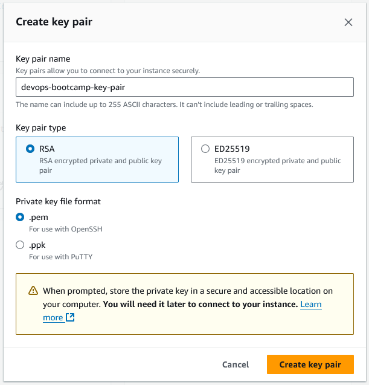

**Demo Project:**

Complete CI/CD with Terraform

**Technologies used:**

Terraform, Jenkins, Docker, AWS, Git, Java, Maven, Linux, Docker Hub

**Project description:**

Integrate provisioning stage into complete CI/CD Pipeline to automate
provisioning server instead of deploying to an existing server:

-   Create a SSH Key Pair

-   Install Terraform inside Jenkins container

-   Add Terraform configuration to application's git repository

-   Adjust Jenkinsfile to add 'provision' step to the CI/CD pipeline
    that provisions EC2 instance

-   So the complete CI/CD project we build has the following
    configuration:

a.  CI step: build artifact for Java Maven application

b.  CI step: Build and push Docker image to Docker Hub

c.  CD step: Automatically provision EC2 instance using TF

d.  CD step: Deploy new application version on the provisioned EC2
    instance with Docker Compose

This project involves integrating Terraform into a complete CI/CD
pipeline to automate the provisioning of infrastructure rather than
deploying to pre-existing servers. The process begins by creating an SSH
key pair and installing Terraform within a Jenkins container. Terraform
configuration files are added to the application\'s Git repository, and
the Jenkinsfile is adjusted to include a new \"provision\" step. This
step automates the provisioning of an EC2 instance on AWS as part of the
deployment process. The CI/CD pipeline is structured as follows:

1.  **CI Stage:** Build the Java Maven application artifact.

2.  **CI Stage:** Build a Docker image for the application and push it
    to Docker Hub.

3.  **CD Stage:** Automatically provision an EC2 instance using
    Terraform.

4.  **CD Stage:** Deploy the new application version on the provisioned
    EC2 instance using Docker Compose.

**What I\'ve Learned:**

-   How to integrate Terraform into a CI/CD pipeline for automated
    infrastructure provisioning.

-   Setting up and managing a complete CI/CD pipeline with Jenkins, from
    building to deployment.

-   The use of Terraform for infrastructure-as-code to provision EC2
    instances on AWS.

-   Managing application deployment with Docker Compose on a freshly
    provisioned server.

-   How to adjust Jenkinsfile configurations to incorporate
    infrastructure provisioning steps.

-   The importance of automation in streamlining the deployment process
    and reducing manual intervention.

-   Utilizing Docker Hub for storing and managing Docker images within
    the CI/CD workflow.


We\'ll start off from what we had in [project 1](https://github.com/Tyronnosaurus/jenkins-cicd-java-kubernetes-ecr). We simply need to modify
the Jenkinsfile to have these stages:

a.  Build artifact for Java Maven application → Already done

b.  Build and push Docker image to Docker Hub → Already done

c.  Automatically provision EC2 instance using Terraform.

d.  Deploy new application version on the provisioned EC2 instance with
    Docker Compose

We do not need to increment the app version (in pom.xml) every time we
run the pipeline. However, it is useful to have a stage in which we
check the version of the app and build number, in order to generate a
name for the image that includes the app\'s version.

The Jenkinsfile and terraform file have been prepared in this repository
(under the jenkins-terraform branch):

https://gitlab.com/etiron/java-maven-app/-/tree/jenkins-terraform?ref_type=heads

## Create Key Pair



Download the pem file and copy it into the Jenkins container so that it
is available to Jenkins. We also need to change its owner and
permissions because ssh complains if the key is not correctly secured:

```
docker ps # Get container id for next command

docker cp "devops-bootcamp-key-pair.pem" 8114c72b2a66:/var/jenkins_home/.ssh/key.pem

docker exec -u 0 -it 8114c72b2a66 bash # Enter container

chown jenkins:jenkins /var/jenkins_home/.ssh/key.pem

chmod 400 /var/jenkins_home/.ssh/key.pem
```

## Add Jenkins job

\[Do this on Chrome. Jenkins is buggy on Firefox and some menus don\'t
work properly\]

Jenkins GUI → Create job: name *java-app-EC2*, type Pipeline

Configure it with \'Pipeline script from SCM\'.

Add the repository url: <https://gitlab.com/redjules/java-maven-app.git>

Add the credentials from GitLab (with ID gitlab-credentials).

Branch: \*/jenkins-terraform

Script path: Jenkinsfile

## Prepare DockerHub credentials

Register on DockerHub and add your credentials in Jenkins:


## Prepare Terraform files

We\'ve created the required Terraform files in the \'terraform\' folder.
When the pipeline commits the code, it will be able to access the folder
with dir(terraform) and execute terraform commands.

## Prepare AWS credentials

Terraform will need to connect to AWS. To configure the credentials, we
first install this plugin:

Dashboard \> Manage Jenkins \> Plugins \> Install \'AWS Credentials\'

Add CLI credentials for an AWS user:


## Install Terraform in Jenkins container
```
docker ps # Get container id for next command

docker exec -u 0 -it 8114c72b2a66 bash

apt update && apt install wget

apt update && apt install -y lsb-release && apt-get clean all

wget -O- https://apt.releases.hashicorp.com/gpg | gpg --dearmor -o
/usr/share/keyrings/hashicorp-archive-keyring.gpg

echo "deb [signed-by=/usr/share/keyrings/hashicorp-archive-keyring.gpg] https://apt.releases.hashicorp.com $(lsb_release -cs) main" | tee
/etc/apt/sources.list.d/hashicorp.list

apt update && apt install terraform
```

# Results

The pipeline now finishes successfully:


The image is being pushed to Docker Hub:


The EC2 instance is created:


And we can visit the application at the instance\'s public IP:


